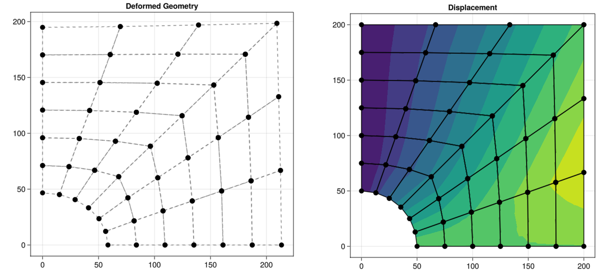

# SONiA

SONiA is a SOlver for Numerical Aplications written in Julia Programming Language to enhance knowledge on this topic



## How to use it

* Download and install Julia Programming language for your platform: https://julialang.org/
* Download and install Visual Studio Code for your platform: https://code.visualstudio.com/
* Follow the steps to set up Julia in VS Code: https://code.visualstudio.com/docs/languages/julia

## How to create/read an example file?

#### 0. Write a geometry file as follow:

* first of all the number of elements
* you need a connectivity matrix where you define the element number (1,2,..,n), the number of nodes (3 or 4), the associated material (1,2,..,n) and the nodes' order.
  * Right now the solver can handle just 1 material, but the connectivity matrix is generalized to implement multiple materials
  * Mesh with triangles is not tested, so they will probably not work
* now you need node numbering and coordinates for nodes
  **EXAMPLE:**
  
  ```
  2
  1 4 1 1 2 3 4  
  2 4 1 4 3 6 5  
  1 50.0 0.0    
  2 200.0 0.0    
  3 200.0 200.0    
  4 35.3553 35.3553  
  5 0.0 50.0   
  6 0.0 200.0  
  ```

#### 1. Create a new julia file and activate SONiA package

```julia
import Pkg
Pkg.activate(".")

using SONiA 
```

#### 2. Select and read your geometry file

```julia
GEOM_NAME = "foo"
conn_tris, conn_quads, coord = readInput(GEOM_NAME) 
```

you now have connectivity for triangles (conn_tris), for quadrangles (conn_quads) and the coordinates matrix (coord)

why not? Plot your geometry using PL function

```julia
PL("Geometry", conn_tris, conn_quads, coord)
```

#### 3. Define Material and problem type

```julia
MAT_NAME = "Steel"
PROB_TYPE = "Plane_Stress"
```

All materials are defined in the folder "materials" and are linear-elastic. You can choose to use custom linear-elastic material modifying the "Custom.txt" file or adding new material files.
IMPORTANT: only linear-elastic material work!

#### 4. Dirichlet BCs

* create a box to get the nodes you want to constaint
  
  ```julia
  xv = [ -0.1 0.1 0.1 -0.1 -0.1]
  yv = [ 0. 0. 210. 210. 0.]
  ```

* define the type of constraint
  
  ```julia
  BC_type = 10
  ```

* Apply BC
  
  ```julia
  BC_Dirichlet_1 = BC_Dirichlet(BC_box(xv,yv,coord),BC_type,0.0,0.0)
  ```
  
  here you can also define a prescribed displacement (in the example is set to 0.0) 
  If you like you can plot a different color (:red) for the selected nodes using
  
  ```julia
  plotBC(BC_box(xv,yv,coord)[:,2], BC_box(xv,yv,coord)[:,3], :red)
  ```

* Get all Dirichlet BCs
  
  ```julia
  all_BC_Dirichlet = vcat(BC_Dirichlet_1, BC_Dirichlet_2,...)
  ```

* Repeat step **4.** for all Dirichlet BCs

#### 5. Neumann BCs (here things becomes hard!)

* Define Nodal Forces
  ...

* Define Distributed Forces
  
  ```julia
  FORCE_TYPE = "Distributed"
  NORMAL_FORCE = 1
  TANGENTIAL_FORCE = 1
  ```

* create a box to get the nodes you want to constaint
  
  ```julia
  xv = [ 200.0-0.1 200.0+0.1 200.0+0.1 200.0-0.1 200.0-0.1]
  yv = [ -0.1 -0.1 210. 210. -0.1]
  ```

* Apply BC (calculate force vector)
  
  ```julia
  FF_1 = BC_Neumann(coord, conn_quads, BC_box(xv,yv,coord), NORMAL_FORCE, TANGENTIAL_FORCE)
  ```
  
  If you like you can plot a different color (:blue) for the selected nodes using
  
  ```julia
  plotBC(BC_box(xv,yv,coord)[:,2], BC_box(xv,yv,coord)[:,3], :blue)
  ```

* Assemble all BC Neumann
  
  ```julia
  FF_all = vcat(FF_1)
  ```

#### 6. SOLVE

* Call the solver you need to get the resutl
  
  ```julia
  U = elastSolver(conn_tris, conn_quads, coord, MAT_NAME, PROB_TYPE, all_BC_Dirichlet, FF_all)
  ```

---

---

#### 7. Post Processing

* Define multiplier factor
  
  ```julia
  FACTOR = 10
  ```

* Recover fields to plot
  
  * separate ux and uy using the function splitU
    
    ```julia
    ux,uy = splitU(U,coord)
    ```
  * calculate Utot
    
    ```julia
    utot = uTot(ux, uy)
    ```
  * calculate stressess at GPs positions
    
    ```julia
    sx, sy, txy = stressCalcGP(U, conn_quads, coord, MAT_NAME, PROB_TYPE)
    ```
  * calculate avarage stressess
    
    ```julia
    avrsx = avarageStress(sx, conn_quads, coord)
    avrsy = avarageStress(sy, conn_quads, coord)
    avrtxy = avarageStress(txy, conn_quads, coord)
    ```

* Plot the results you want using PL
  
  ```julia
  PL("FIELD", FIELD, conn_tris, conn_quads, coord) 
  ```
  
  sustituting FIELD with the quantity you want for example: utot, avrsx, etc.
  If you like to plot the deformed shape substitute "coord" with the deformed one using the function defCoord
  
  ```julia
  defCoord(coord, ux, uy, FACTOR)
  ```

---

---

See "quarter_of_plate.jl" example to use the program.